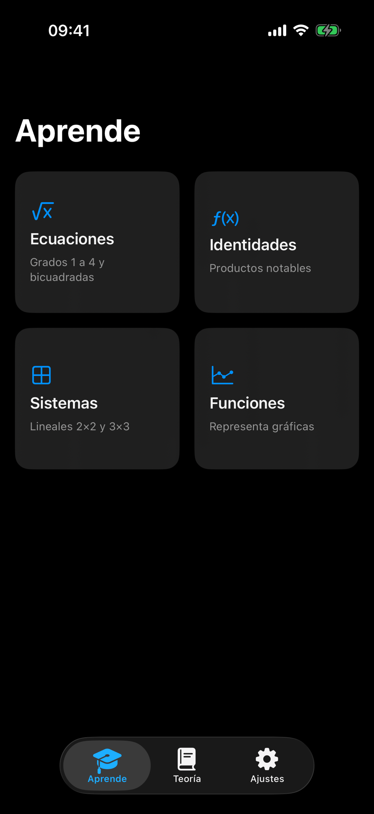
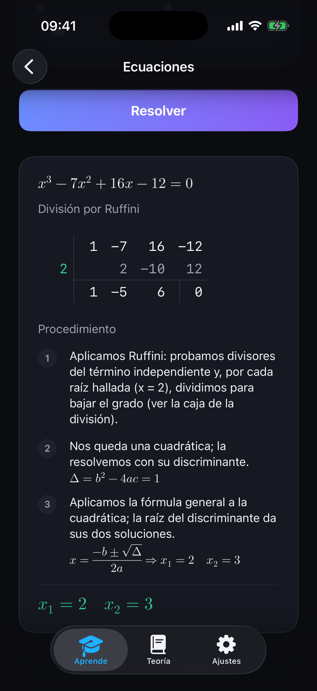
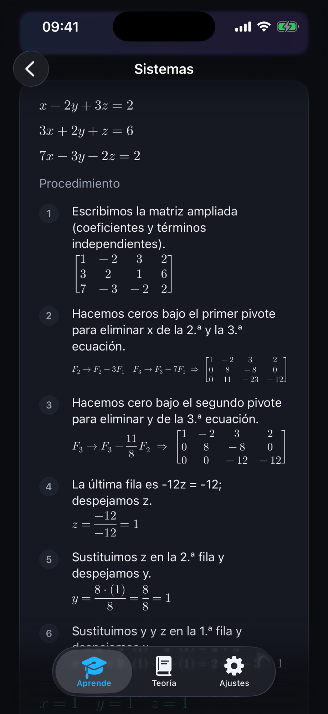
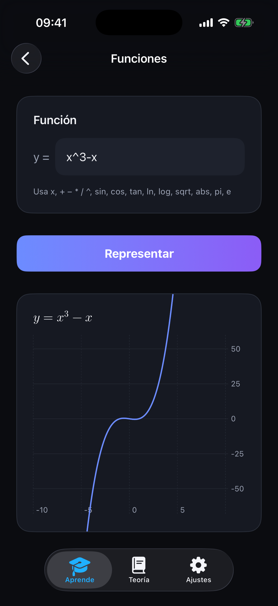
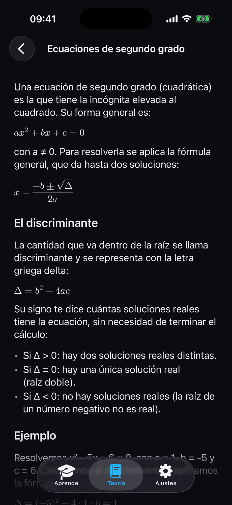
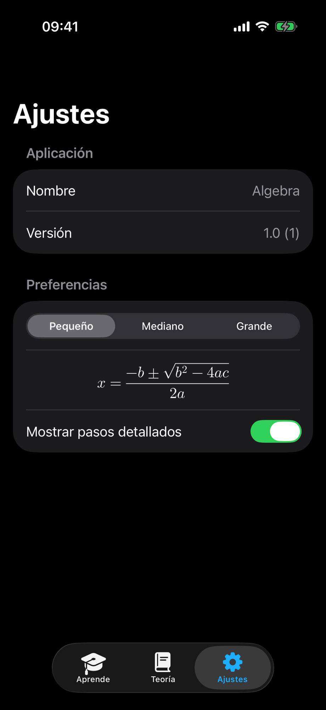

# Álgebra

**App iOS nativa para estudiar álgebra de bachillerato**: resuelve ecuaciones, sistemas, identidades notables y representa funciones — con la **explicación paso a paso** y las fórmulas renderizadas como en un libro.

> TFM del *Máster de Desarrollo con IA*. La app se ha construido íntegramente **con Claude Code**, orquestando agentes especializados; el proceso está documentado como evidencia (ver [Trabajo con IA](#trabajo-con-ia)).


---

## Índice
- [Qué es](#qué-es)
- [Capturas](#capturas)
- [Funcionalidades](#funcionalidades)
- [Stack técnico](#stack-técnico)
- [Arquitectura](#arquitectura)
- [Estructura de carpetas](#estructura-de-carpetas)
- [Cómo ejecutarla](#cómo-ejecutarla)
- [Tests](#tests)
- [Trabajo con IA](#trabajo-con-ia)
- [Autoría y licencia](#autoría-y-licencia)

---

## Qué es

**Álgebra** es una herramienta de estudio *local-first* (sin backend ni cuenta) pensada para que un
estudiante de bachillerato **compruebe sus ejercicios y entienda el porqué de cada paso**. No se limita
a dar el resultado: reproduce el procedimiento humano (distribuir, agrupar, despejar, sustituir…) con
frases en lenguaje natural intercaladas con los cálculos, y renderiza toda la notación matemática con
tipografía TeX.

## Capturas

| Aprende | Ecuaciones (Ruffini, paso a paso) | Sistemas (Gauss) |
|:---:|:---:|:---:|
|  |  |  |
| **Funciones** | **Teoría** | **Ajustes** |
|  |  |  |

## Funcionalidades

- **Ecuaciones** de grado 1 a 4 y **bicuadradas**: 1.º/2.º por fórmula, 3.º/4.º por **Ruffini** (con la
  *caja de división sintética* dibujada), bicuadradas por **cambio de variable** `t = x²`. Explicación
  paso a paso y solución destacada.
- **Sistemas lineales 2×2 y 3×3**, con **métodos según el tamaño**: sustitución / igualación / reducción
  (2 ecuaciones) y **Cramer / Gauss** (3 ecuaciones). Soluciones en **fracciones exactas**; los casos
  compatibles indeterminados se resuelven en **forma paramétrica** (en función de `t`).
- **Identidades notables simbólicas**: acepta **monomios** (`5x`, `4r`…), no solo números, y muestra el
  desarrollo agrupado (`(5x − 4r)² = 25x² − 40rx + 16r²`).
- **Funciones**: **entrada de texto libre** con un *parser* propio (descenso recursivo, multiplicación
  implícita) que interpreta `2cos(3x)`, `x^2+3x`, `e^x`… y dibuja la gráfica con **Swift Charts**.
- **Teoría**: 8 artículos con contenido real (ecuaciones, Ruffini, sistemas, Cramer, Gauss).
- **Render de fórmulas** tipo libro (LaTeX) con **SwiftMath**, con autoajuste al ancho (sin scroll).
- **Ajustes** persistentes: **tamaño de fórmulas** (con vista previa en vivo) y **mostrar/ocultar los
  pasos** detallados.
- **Diseño oscuro** con *design system* propio y **accesibilidad** (Dynamic Type, etiquetas VoiceOver,
  *touch targets* ≥ 44 pt).

## Stack técnico

| Área | Tecnología |
|---|---|
| Plataforma | iOS **26.1** (iPhone) |
| UI | **SwiftUI** + framework **Observation** (`@Observable`) |
| Concurrencia | Swift Concurrency (`@MainActor`, `Sendable`) |
| Persistencia | Local: repositorios en memoria + `UserDefaults` (preferencias). Sin backend |
| Gráficas | **Swift Charts** |
| Render matemático | **[SwiftMath](https://github.com/mgriebling/SwiftMath)** (SPM) |
| Tests | **Swift Testing** (`@Test` / `#expect`) |
| Arquitectura | **MVVM + Clean Architecture** |

## Arquitectura

MVVM + Clean Architecture con una **regla de dependencias** estricta:

```
Presentation ──▶ Domain ◀── Data
                   ▲
                  Core  (DI · Design System · Preferencias)
```

- **Domain** — Swift puro (sin SwiftUI): entidades `Sendable`, casos de uso y protocolos de repositorio.
- **Data** — implementación de repositorios (seed en memoria, `UserDefaults`).
- **Presentation** — vistas SwiftUI + ViewModels `@Observable @MainActor`. **Las vistas reciben solo
  tipos primitivos**; un `UIMapper` convierte las entidades a `ViewState` en el ViewModel.
- **Core** — inyección de dependencias (factories), *design system* (tokens y componentes) y el store de
  preferencias.

Decisiones registradas en [`docs/DECISIONS.md`](docs/DECISIONS.md) (ADR-lite).

## Estructura de carpetas

```
Algebra/Algebra/
├── AlgebraApp.swift        · punto de entrada (@main)
├── Domain/                 · Entities · UseCases · Repositories · Errors  (Swift puro)
├── Data/                   · Repositories (seed en memoria, UserDefaults)
├── Presentation/           · Features: Equations · Systems · Identities · Functions ·
│                             Theory · Home · Settings · Expressions · Shared · Root
├── Core/                   · DI · DesignSystem · Preferences
└── Assets.xcassets
docs/                       · USER-STORIES · DECISIONS · COMPONENTS · AI-WORKFLOW (evidencia)
```

## Cómo ejecutarla

**Requisitos:** macOS con **Xcode 26** (SDK de iOS 26.1).

1. Clona el repositorio.
2. Abre **`Algebra/Algebra.xcodeproj`** en Xcode.
3. Xcode resolverá solo la dependencia SPM (**SwiftMath**) al abrir. Si no, `File ▸ Packages ▸ Resolve
   Package Versions`.
4. Selecciona un simulador de **iPhone (iOS 26.1)** — p. ej. *iPhone 17 Pro* — y pulsa **Run** (`⌘R`).

No hace falta configuración adicional ni cuenta: **la app es local y no tiene login**, así que **no hay
credenciales de prueba**.

## Tests

La lógica de Domain y Presentation está cubierta con **Swift Testing** (169 pruebas, patrón
*Given-When-Then*). Para ejecutarlas:

```bash
xcodebuild test -scheme Algebra -destination 'platform=iOS Simulator,name=iPhone 17 Pro'
```

O en Xcode con `⌘U`.

## Trabajo con IA

Al ser un TFM del *Máster de Desarrollo con IA*, el **proceso** es parte del entregable. La app se
desarrolló con **Claude Code** orquestando **agentes especializados** con responsabilidad única
(lógica, UI, tests) y manteniendo el contexto en archivos versionados:

- [`docs/AI-WORKFLOW.md`](docs/AI-WORKFLOW.md) — el método de trabajo con IA (incluye el paso de
  **validación humana y adaptación**).
- [`docs/USER-STORIES.md`](docs/USER-STORIES.md) — historias de usuario con criterios de aceptación.
- [`docs/DECISIONS.md`](docs/DECISIONS.md) — bitácora de decisiones técnicas (ADR-lite).
- [`docs/COMPONENTS.md`](docs/COMPONENTS.md) — catálogo de componentes (para reutilizar, no duplicar).
- [`.claude/agents/`](.claude/agents/) — las reglas de cada agente.

## Autoría y licencia

- **Autor:** Alfonso Mariscal Ávila
- **Contexto:** TFM · Máster de Desarrollo con IA
- **Licencia:** [MIT](LICENSE)
