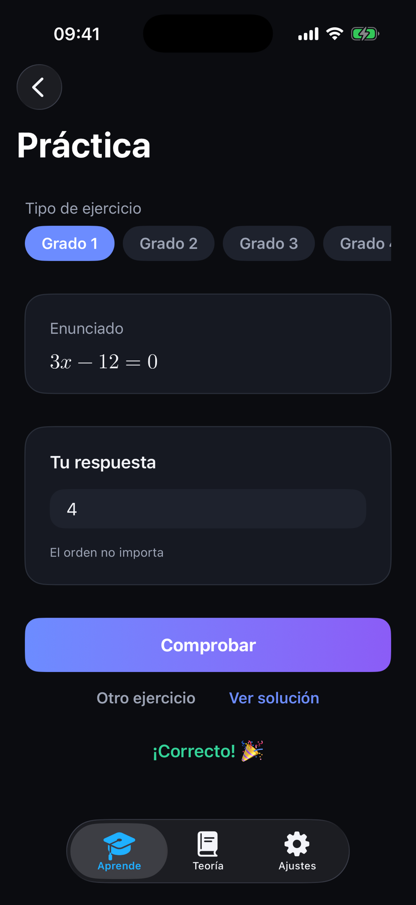
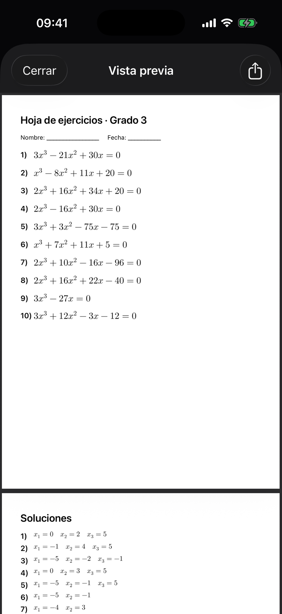

<!-- _class: lead invert -->
# Álgebra

### App iOS para estudiar álgebra de bachillerato — resuelve **y explica**

TFM · Máster de Desarrollo con IA
**Alfonso Mariscal Ávila**

Desarrollada con **IA como copiloto** (validación y decisiones humanas)

---

## En qué consiste

**Álgebra** es una app iOS **local-first** (sin backend ni cuenta) que resuelve
**ecuaciones, sistemas, identidades y funciones**, y sobre todo **explica el
procedimiento paso a paso** con notación matemática de libro.

Doble objetivo del TFM:
1. Una **app real y útil**.
2. Demostrar un **proceso de desarrollo con IA** estructurado, trazable y reproducible.

---

## El problema → la propuesta

- Las calculadoras dan el **resultado**, no el **razonamiento**.
- Un estudiante necesita entender *por qué* se hace cada paso.

**Propuesta:** cada solución se acompaña de una **explicación humana** (frases +
cálculos) y de la **fórmula renderizada**; y el **método es elegible** (p. ej. Gauss vs.
Cramer) para estudiar como en clase.

---

## Funcionalidades

- **Ecuaciones** de grado 1–4 y bicuadradas (Ruffini con su caja; cambio de variable).
- **Sistemas** 2×2 y 3×3: sustitución/igualación/reducción y **Cramer/Gauss**, en
  **fracciones exactas**; casos indeterminados resueltos en **forma paramétrica**.
- **Identidades notables** simbólicas (con monomios: `5x`, `4r`…).
- **Funciones**: entrada de **texto libre** (parser propio) + gráfica con Swift Charts.
- **Práctica**: genera ejercicios y **autocorrige** (acepta fracciones); coef. líder variable,
  soluciones fraccionarias y raíces dobles.
- **Generar ejercicios**: 10 ejercicios en **PDF imprimible** con soluciones y vista previa.
- **Teoría**: 8 artículos con contenido real.
- **Ajustes** persistentes (tamaño de fórmulas, mostrar pasos). Diseño oscuro y accesible.

---

## Ecuaciones · resolución explicada


- Grados 1–4 y bicuadradas.
- 3.º/4.º por **Ruffini**: se muestra la **caja de la división sintética** y cómo baja el grado.
- Cada paso es una **frase** + su **fórmula**; la solución final va destacada.

---

## Sistemas · método a elegir


- 2×2 y 3×3; el método se ajusta al tamaño.
- **Gauss**: la matriz ampliada se **reduce paso a paso** hasta triangular.
- **Cramer**: determinantes por Sarrus. Todo en **fracciones exactas**.

---

## Funciones y Teoría

 

- Escribes la función como **texto** (`2cos(3x)`, `x^2+3x`, `e^x`); un **parser propio** la
  interpreta (con multiplicación implícita) y la **grafica**.
- **Teoría**: explicaciones reales de cada tema, con sus fórmulas.

---

## Práctica · genera y autocorrige



- La app **genera ejercicios** con solución garantizada (ecuaciones 1–4, bicuadradas, sistemas 2×2/3×3).
- Escribes la respuesta (acepta **fracciones** como `3/2`) y **autocorrige** (verde/rojo).
- **Ver solución** paso a paso; generación variada: coef. líder, fracciones (~30%) y **raíces dobles**.

---

## Generar ejercicios · hoja PDF



- **10 ejercicios** del tipo elegido en un **PDF imprimible**, con **página de soluciones**.
- **Vista previa** in-app (PDFKit) + compartir / imprimir.
- Para que el profesor reparta o el alumno practique en papel.

---

## Stack técnico

| Área | Tecnología |
|---|---|
| Plataforma | iOS 26 (iPhone) |
| UI | SwiftUI + framework **Observation** (`@Observable`) |
| Gráficas | Swift Charts |
| Render de fórmulas | **SwiftMath** (LaTeX, vía SPM) |
| Tests | Swift Testing |
| Persistencia | Local (`UserDefaults`) — sin backend |
| Arquitectura | MVVM + Clean Architecture |

---

## Arquitectura · MVVM + Clean

```
Presentation ──▶ Domain ◀── Data        (Core: DI · Design System · Preferencias)
```

- **Domain** (Swift puro): entidades, casos de uso y repositorios tras **protocolo** →
  datos intercambiables sin tocar la lógica.
- **Data**: implementación de repositorios (memoria, `UserDefaults`).
- **Presentation**: ViewModels `@Observable`; las **vistas reciben solo primitivos** y un
  **UIMapper** traduce el dominio a lo que se pinta.
- **Ventaja**: lógica **testeable** y vistas reutilizables.

---

## Desarrollo con IA · el diferencial

- **IA como copiloto** orquestando **agentes** con rol único: **lógica · UI · tests**.
- Contexto perdurable en el repositorio:
  **historias de usuario · decisiones (ADR) · catálogo de componentes · método de trabajo**.
- Cada feature **nace de una historia**, pasa por los agentes y **se registra**: evita
  duplicados y deja **trazabilidad** completa del proyecto.

---

## El ciclo humano–IA

1. Historia de usuario → 2. Decisiones → 3. Lógica → 4. UI → 5. Tests →
**6. Validación humana** → 7. Registrar

- Compilar y pasar los tests **no cierra** una feature: la persona **ejecuta la app** y
  valida lo que la automatización no ve (render, UX, corrección matemática).
- **La IA propone; el humano valida, adapta y decide.**

---

## Un reto real · el crash "invisible"

- **Síntoma:** la app abortaba al mostrar ciertas fórmulas **válidas**.
- **Lo engañoso:** **compilaba** y los **tests pasaban en verde**; solo fallaba **al ejecutar**.
- **Diagnóstico** (gracias a la validación humana): el depurador señaló un par de átomos que
  la librería de fórmulas marca inválido (una coma pegada a un signo).
- **Solución:** corregir en origen + una **red de seguridad central** que sanea el LaTeX.

---

## Calidad · pruebas

- **217 pruebas** con Swift Testing (patrón *Given-When-Then*).
- Cubren los **solvers** (Gauss, Cramer, Ruffini), el **parser**, las **fracciones**, los
  sistemas, las identidades y las preferencias.
- Lógica de dominio verificada de forma **aislada**; ViewModels con dobles de prueba.

---

## Decisiones clave (registradas como ADR)

- **Render de fórmulas**: SwiftMath (nativo) frente a WebView/MathJax → rendimiento.
- **Preferencias**: repositorio + **Environment** (no `@AppStorage` disperso).
- **Diseño**: tema oscuro y explicación modelada como paso reutilizable (`ExplanationStep`).

Cada decisión, con su contexto, alternativas y motivo, está en `docs/DECISIONS.md`.

---

## Entregables y enlaces

- **Repositorio público:** `github.com/mathVirtualLearn/Algebra`
- **TestFlight:** _(enlace público — pendiente)_
- **Vídeo:** _(URL — pendiente)_
- **Cómo ejecutar:** abrir `Algebra/Algebra.xcodeproj` en Xcode 26 (SPM se resuelve solo) y
  *Run* en un iPhone con iOS 26. **Sin login**, no hay credenciales de prueba.

---

<!-- _class: lead invert -->
## Aprendizajes y cierre

- Orquestar IA con **roles y documentos** rinde más que un único prompt.
- La **validación humana** es insustituible.
- Clean Architecture facilitó **probar** y **aislar** la lógica.

**Objetivo doble cumplido: app real + proceso con IA demostrable.**

### Gracias
